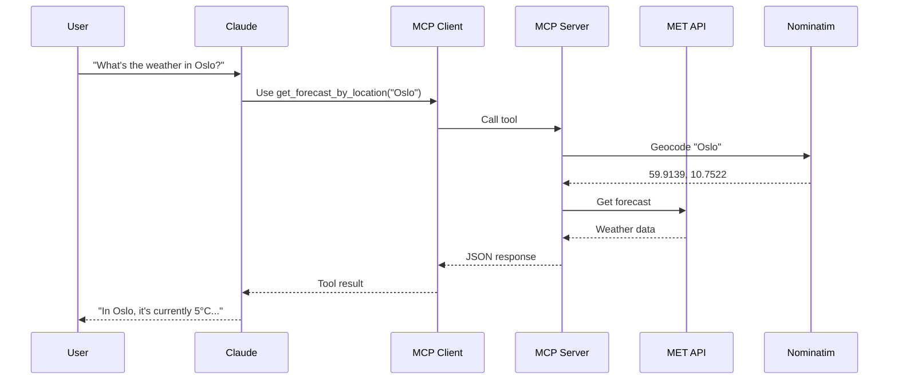

# Build Your First MCP Server: Weather Forecast Tool

Get started building your own MCP server to use with Claude for Desktop and other clients.

## What We'll Build

In this tutorial, we'll build a weather MCP server that exposes two tools:

- **`get_forecast`** - Get weather forecast using exact coordinates (latitude/longitude)
- **`get_forecast_by_location`** - Get weather forecast using location names (e.g., "Oslo", "Paris, France")

Then we'll connect the server to Claude for Desktop so you can ask questions like "What's the weather in Tokyo?" and get real-time weather data.

::: tip Global Coverage
Unlike the official MCP tutorial which uses the US National Weather Service, this tutorial uses the MET Norway API which provides global weather coverage for any location worldwide.
:::

## Core MCP Concepts

MCP servers can provide three main types of capabilities:

- **Resources**: File-like data that can be read by clients (like API responses or file contents)
- **Tools**: Functions that can be called by the LLM (with user approval)
- **Prompts**: Pre-written templates that help users accomplish specific tasks

This tutorial focuses on **tools** - the most common and powerful capability.

## Prerequisites

This tutorial assumes you have familiarity with:

- TypeScript basics
- Node.js and npm
- LLMs like Claude
- Basic understanding of REST APIs

## System Requirements

You'll need:

- **Node.js 18 or higher** - [Download from nodejs.org](https://nodejs.org/)
- **Claude for Desktop** - [Download here](https://claude.ai/download) (for testing)

Verify your Node.js installation:

```bash
node --version  # Should be 18.0.0 or higher
npm --version
```

## Important: Logging in MCP Servers

::: danger Critical Requirement
When implementing MCP servers that use STDIO transport, **NEVER write to standard output (stdout)**. This includes:

- `console.log()` in JavaScript/TypeScript
- `print()` in Python
- `fmt.Println()` in Go

Writing to stdout will corrupt the JSON-RPC messages and break your server.
:::

**Safe alternatives:**

```typescript
// ❌ Bad - writes to stdout
console.log("Server started");

// ✅ Good - writes to stderr
console.error("Server started");
```

For HTTP-based servers, standard output logging is fine since it doesn't interfere with HTTP responses.

## Set Up Your Environment

### Create the Project

Let's create a new project directory and initialize it:

```bash
# Create a new directory
mkdir weather-mcp-server
cd weather-mcp-server

# Initialize npm project
npm init -y
```

### Install Dependencies

Install the required packages:

```bash
# Core dependencies
npm install @modelcontextprotocol/sdk zod

# Development dependencies
npm install -D @types/node typescript
```

Here's what each dependency does:

- **@modelcontextprotocol/sdk** - The official MCP SDK for TypeScript
- **zod** - Schema validation library for defining tool input schemas
- **@types/node** - TypeScript type definitions for Node.js
- **typescript** - TypeScript compiler

### Configure package.json

Update your `package.json` to include the necessary configuration:

```json
{
  "name": "weather-mcp-server",
  "version": "1.0.0",
  "description": "A Model Context Protocol server for weather forecasts",
  "type": "module",
  "bin": {
    "weather-mcp-server": "build/index.js"
  },
  "scripts": {
    "build": "tsc && chmod 755 build/index.js",
    "inspect": "npx @modelcontextprotocol/inspector node build/index.js"
  },
  "files": ["build"],
  "dependencies": {
    "@modelcontextprotocol/sdk": "^1.25.2",
    "zod": "^3.25.76"
  },
  "devDependencies": {
    "@types/node": "^25.0.3",
    "typescript": "^5.9.3"
  },
  "engines": {
    "node": ">=18.0.0"
  }
}
```

Key points:

- **`"type": "module"`** - Enables ES modules
- **`bin`** - Makes your server executable
- **`build` script** - Compiles TypeScript and makes the output executable

### Configure TypeScript

Create a `tsconfig.json` file in your project root:

```json
{
  "compilerOptions": {
    "target": "ES2022",
    "module": "Node16",
    "moduleResolution": "Node16",
    "outDir": "./build",
    "rootDir": "./src",
    "strict": true,
    "esModuleInterop": true,
    "skipLibCheck": true,
    "forceConsistentCasingInFileNames": true
  },
  "include": ["src/**/*"],
  "exclude": ["node_modules"]
}
```

### Create Source Directory

```bash
mkdir src
touch src/index.ts
touch src/weather.ts
```

## Build the Weather API Module

We'll separate concerns by putting the weather API logic in a separate file. This keeps our MCP server code clean and focused.

Create `src/weather.ts`:

```typescript
/**
 * Weather API Module
 *
 * Simple wrapper around MET Norway API and OpenStreetMap Nominatim.
 * Returns data in a format that AI assistants can easily interpret.
 */

// IMPORTANT: Replace with your contact information
const USER_AGENT = "WeatherMCPServer/1.0 your.email@example.com";

const MET_API_BASE = "https://api.met.no/weatherapi/locationforecast/2.0";
const NOMINATIM_BASE = "https://nominatim.openstreetmap.org";

// Simple HTTP request helper
async function fetchJson<T>(url: string): Promise<T | null> {
  try {
    const response = await fetch(url, {
      headers: { "User-Agent": USER_AGENT },
    });
    if (!response.ok) return null;
    return await response.json() as T;
  } catch {
    return null;
  }
}

/**
 * Get weather forecast for coordinates
 */
export async function getForecastByCoordinates(
  lat: number,
  lon: number
): Promise<string> {
  const latitude = lat.toFixed(4);
  const longitude = lon.toFixed(4);

  const url = `${MET_API_BASE}/compact?lat=${latitude}&lon=${longitude}`;
  const data = await fetchJson<any>(url);

  if (!data) {
    return "Unable to fetch weather data";
  }

  // Return the data as JSON - the AI can interpret it
  return JSON.stringify(data, null, 2);
}

/**
 * Get weather forecast by location name
 */
export async function getForecastByLocation(location: string): Promise<string> {
  // Geocode first
  const geoUrl = `${NOMINATIM_BASE}/search?q=${encodeURIComponent(location)}&format=json&limit=1`;
  const geoResults = await fetchJson<Array<{ lat: string; lon: string; display_name: string }>>(geoUrl);

  if (!geoResults || geoResults.length === 0) {
    return `Could not find location: ${location}`;
  }

  const { lat, lon, display_name } = geoResults[0];
  const latitude = parseFloat(lat).toFixed(4);
  const longitude = parseFloat(lon).toFixed(4);

  // Get weather
  const url = `${MET_API_BASE}/compact?lat=${latitude}&lon=${longitude}`;
  const data = await fetchJson<any>(url);

  if (!data) {
    return `Unable to fetch weather for ${display_name}`;
  }

  // Return location name + weather data as JSON
  return `Location: ${display_name}\n\n${JSON.stringify(data, null, 2)}`;
}
```

::: warning User-Agent Required
MET Norway requires a proper User-Agent header that identifies your application and includes contact information. Replace `your.email@example.com` with your actual email address, or they may block your requests.
:::

### How the Weather Module Works

1. **`fetchJson`** - A generic helper that handles HTTP requests with proper headers
2. **`getForecastByCoordinates`** - Fetches weather directly using lat/lon
3. **`getForecastByLocation`** - First geocodes the location name to coordinates, then fetches weather

The functions return raw JSON data because Claude (and other LLMs) are excellent at interpreting structured data and presenting it conversationally to users.

## Build the MCP Server

Now let's create the main MCP server in `src/index.ts`. This file demonstrates the core MCP concepts:

```typescript
#!/usr/bin/env node

/**
 * Weather MCP Server Tutorial
 *
 * This file demonstrates the core concepts of building an MCP server:
 * 1. Creating a server instance
 * 2. Registering tools with input schemas
 * 3. Implementing tool handlers
 * 4. Connecting to a transport (stdio)
 *
 * The actual weather API logic is in weather.ts to keep this focused on MCP.
 */

import { McpServer } from "@modelcontextprotocol/sdk/server/mcp.js";
import { StdioServerTransport } from "@modelcontextprotocol/sdk/server/stdio.js";
import { z } from "zod";
import { getForecastByCoordinates, getForecastByLocation } from "./weather.js";

// ============================================================================
// STEP 1: Create the MCP server
// ============================================================================

const server = new McpServer({
  name: "weather",
  version: "1.0.0",
});

// ============================================================================
// STEP 2: Register tools
// ============================================================================

// Tool 1: Get forecast using exact coordinates
server.registerTool(
  "get_forecast",
  {
    description: "Get weather forecast for specific coordinates",
    inputSchema: {
      latitude: z.number().min(-90).max(90).describe("Latitude"),
      longitude: z.number().min(-180).max(180).describe("Longitude"),
    },
  },
  async ({ latitude, longitude }) => {
    const forecast = await getForecastByCoordinates(latitude, longitude);
    return {
      content: [{ type: "text", text: forecast }],
    };
  }
);

// Tool 2: Get forecast using a location name (more user-friendly)
server.registerTool(
  "get_forecast_by_location",
  {
    description: "Get weather forecast by location name (city, address, etc)",
    inputSchema: {
      location: z.string().describe("Location name (e.g. 'Oslo', 'Paris')"),
    },
  },
  async ({ location }) => {
    const forecast = await getForecastByLocation(location);
    return {
      content: [{ type: "text", text: forecast }],
    };
  }
);

// ============================================================================
// STEP 3: Start the server
// ============================================================================

async function main() {
  // Create stdio transport (communicate via standard input/output)
  const transport = new StdioServerTransport();

  // Connect the server to the transport
  await server.connect(transport);

  console.error("Weather MCP Server running on stdio");
}

// Run the server
main().catch((error) => {
  console.error("Fatal error:", error);
  process.exit(1);
});
```

### Understanding the Code

#### Step 1: Create the Server Instance

```typescript
const server = new McpServer({
  name: "weather",
  version: "1.0.0",
});
```

This creates an MCP server instance with a name and version. The name will appear in Claude for Desktop's interface.

#### Step 2: Register Tools

Tools are registered using `server.registerTool()` which takes three arguments:

1. **Tool name** - Identifier used by clients
2. **Tool definition** - Description and input schema
3. **Tool handler** - Async function that executes the tool

**Input Schemas with Zod:**

```typescript
inputSchema: {
  latitude: z.number().min(-90).max(90).describe("Latitude"),
  longitude: z.number().min(-180).max(180).describe("Longitude"),
}
```

Zod provides:
- Type validation (e.g., `z.number()`)
- Range constraints (e.g., `.min(-90).max(90)`)
- Descriptions that help the LLM understand what each parameter is

**Tool Handlers:**

```typescript
async ({ latitude, longitude }) => {
  const forecast = await getForecastByCoordinates(latitude, longitude);
  return {
    content: [{ type: "text", text: forecast }],
  };
}
```

Handlers receive validated input and must return a result with:
- `content` array containing response items
- Each item has a `type` (usually "text") and the actual content

#### Step 3: Start the Server

```typescript
async function main() {
  const transport = new StdioServerTransport();
  await server.connect(transport);
  console.error("Weather MCP Server running on stdio");
}
```

This:
1. Creates an STDIO transport (communication via stdin/stdout)
2. Connects the server to the transport
3. Logs to stderr (safe for STDIO servers)

## Build Your Server

Compile the TypeScript code:

```bash
npm run build
```

This will:
1. Compile TypeScript to JavaScript in the `build/` directory
2. Make `build/index.js` executable (the `chmod 755` part)

::: tip Build Before Testing
You must run `npm run build` every time you make changes to the TypeScript source files. The build step is required before testing with Claude for Desktop or the MCP Inspector.
:::

## Test Your Server

### Option 1: MCP Inspector (Recommended for Development)

The MCP Inspector is a web-based tool for testing MCP servers:

```bash
npm run inspect
```

This will open a web interface where you can:
- See all registered tools
- Test tool calls with different inputs
- View request/response payloads
- Debug errors

### Option 2: Claude for Desktop

::: warning Linux Users
Claude for Desktop is not yet available on Linux. Linux users should use the MCP Inspector or build a custom client.
:::

#### Install Claude for Desktop

Download and install [Claude for Desktop](https://claude.ai/download). Make sure you have the latest version.

#### Configure Claude for Desktop

Open your Claude for Desktop configuration file in a text editor:

**macOS:**
```bash
code ~/Library/Application\ Support/Claude/claude_desktop_config.json
```

**Windows:**
```bash
code %APPDATA%\Claude\claude_desktop_config.json
```

Add your weather server to the `mcpServers` section:

**macOS/Linux:**
```json
{
  "mcpServers": {
    "weather": {
      "command": "node",
      "args": ["/absolute/path/to/weather-mcp-server/build/index.js"]
    }
  }
}
```

**Windows:**
```json
{
  "mcpServers": {
    "weather": {
      "command": "node",
      "args": ["C:\\absolute\\path\\to\\weather-mcp-server\\build\\index.js"]
    }
  }
}
```

::: danger Use Absolute Paths
You **must** use absolute paths in the configuration. Relative paths and `~` will not work. Find your absolute path:

**macOS/Linux:**
```bash
pwd  # Run this in your project directory
```

**Windows:**
```bash
cd  # Run this in your project directory
```
:::

#### Restart Claude for Desktop

After saving the configuration, completely quit and restart Claude for Desktop.

#### Verify Server Connection

Look for the **connector icon** (plug icon) in Claude for Desktop. Click it and you should see your "weather" server listed with its two tools:

- `get_forecast`
- `get_forecast_by_location`

If your server doesn't appear, see the [Troubleshooting](#troubleshooting) section below.

### Test with Commands

Try these example queries in Claude for Desktop:

```
What's the weather in Oslo?
```

```
Give me the forecast for Tokyo, Japan
```

```
What's the weather like at coordinates 40.7128, -74.0060?
```

```
Compare the weather in London and Sydney
```

## How It Works Under the Hood

When you ask Claude a question like "What's the weather in Oslo?", here's what happens:

1. **User Input**: You send your message to Claude
2. **Tool Selection**: Claude analyzes the available tools and decides `get_forecast_by_location` is appropriate
3. **Tool Invocation**: The client (Claude for Desktop) calls your MCP server with `location: "Oslo"`
4. **Execution**: Your server:
   - Geocodes "Oslo" to coordinates (59.9139, 10.7522)
   - Fetches weather from MET Norway API
   - Returns formatted JSON data
5. **LLM Processing**: Claude receives the weather data and interprets it
6. **Response**: Claude presents the information conversationally to you



## Project Structure

Your final project should look like this:

```
weather-mcp-server/
├── src/
│   ├── index.ts          # Main MCP server (tools, handlers, transport)
│   └── weather.ts        # Weather API logic (MET Norway, Nominatim)
├── build/                # Compiled JavaScript (auto-generated)
│   ├── index.js
│   └── weather.js
├── node_modules/         # Dependencies (auto-generated)
├── package.json          # Project configuration
├── tsconfig.json         # TypeScript configuration
└── README.md            # Documentation
```

## Extending Your Server

Now that you have a working MCP server, here are some ideas for enhancements:

### Add More Weather Details

MET Norway provides additional data like:
- Air pressure
- Cloud coverage
- UV index
- Precipitation probability

### Add Resources

Expose weather data as resources that can be read:

```typescript
server.registerResource(
  "weather://forecast/{location}",
  async (uri) => {
    // Return forecast as a readable resource
  }
);
```

### Add Prompts

Create pre-written templates for common tasks:

```typescript
server.registerPrompt(
  "daily-forecast",
  {
    description: "Get today's weather forecast",
    arguments: [
      {
        name: "location",
        description: "Your location",
        required: true
      }
    ]
  },
  async ({ location }) => {
    return {
      messages: [
        {
          role: "user",
          content: {
            type: "text",
            text: `What's the weather forecast for today in ${location}?`
          }
        }
      ]
    };
  }
);
```

### Add Caching

Reduce API calls by caching responses:

```typescript
const cache = new Map<string, { data: any, timestamp: number }>();

async function getCachedForecast(lat: number, lon: number) {
  const key = `${lat},${lon}`;
  const cached = cache.get(key);

  if (cached && Date.now() - cached.timestamp < 30 * 60 * 1000) {
    return cached.data; // Use cache if less than 30 minutes old
  }

  const data = await getForecastByCoordinates(lat, lon);
  cache.set(key, { data, timestamp: Date.now() });
  return data;
}
```

### Add Error Handling

Improve error messages for better user experience:

```typescript
try {
  const forecast = await getForecastByLocation(location);
  return { content: [{ type: "text", text: forecast }] };
} catch (error) {
  return {
    content: [{
      type: "text",
      text: `Failed to get forecast: ${error.message}`
    }],
    isError: true
  };
}
```

## API Rate Limits & Terms

### MET Norway

- **Rate Limits**: Very generous, no strict limits documented
- **Requirements**: Proper User-Agent with contact information
- **Terms**: [api.met.no/doc/TermsOfService](https://api.met.no/doc/TermsOfService)
- **Coverage**: Global
- **Authentication**: None required

### OpenStreetMap Nominatim

- **Rate Limits**: Maximum 1 request per second
- **Requirements**: Proper User-Agent
- **Usage Policy**: [operations.osmfoundation.org/policies/nominatim](https://operations.osmfoundation.org/policies/nominatim/)
- **Alternatives**: Consider [Nominatim hosted services](https://nominatim.org/release-docs/latest/api/Search/) or other geocoding APIs for production

::: tip Production Deployment
For production applications with high traffic, consider:
- Using a commercial geocoding service (Google Maps, Mapbox)
- Running your own Nominatim instance
- Implementing aggressive caching
:::

## Troubleshooting

### Server Not Showing in Claude for Desktop

1. **Check the configuration file path** - Make sure you're editing the correct file
2. **Verify JSON syntax** - Use a JSON validator to check for syntax errors
3. **Use absolute paths** - Relative paths won't work
4. **Restart Claude completely** - Quit and relaunch the app
5. **Check server builds** - Run `npm run build` to ensure the latest code is compiled
6. **View logs** - Claude for Desktop logs can help identify issues

**macOS Logs:**
```bash
tail -f ~/Library/Logs/Claude/mcp*.log
```

### 403 Forbidden Errors from MET Norway

Update your User-Agent in `src/weather.ts`:

```typescript
const USER_AGENT = "WeatherMCPServer/1.0 your.email@example.com";
```

Replace with your actual email address.

### Geocoding Not Working

This is usually caused by rate limiting. Nominatim has a strict 1 request per second limit. Add a delay:

```typescript
// Simple rate limiting
let lastRequest = 0;
async function rateLimitedFetch(url: string) {
  const now = Date.now();
  const timeSinceLastRequest = now - lastRequest;
  if (timeSinceLastRequest < 1000) {
    await new Promise(resolve => setTimeout(resolve, 1000 - timeSinceLastRequest));
  }
  lastRequest = Date.now();
  return fetchJson(url);
}
```

### TypeScript Compilation Errors

Make sure you're using Node.js 18 or higher:

```bash
node --version
```

If you see module resolution errors, verify your `tsconfig.json` has:

```json
{
  "compilerOptions": {
    "module": "Node16",
    "moduleResolution": "Node16"
  }
}
```

### Tools Not Being Called

If Claude isn't using your tools:

1. **Check descriptions** - Make sure tool descriptions clearly explain what they do
2. **Test with direct requests** - Try asking "Use the get_forecast_by_location tool for Oslo"
3. **Verify tool registration** - Check the MCP Inspector to see if tools are registered
4. **Check input schemas** - Ensure Zod schemas match what you're testing

## Next Steps

Congratulations! You've built a fully functional MCP server. Here's what to explore next:

### Learn More About MCP

- [MCP Documentation](https://modelcontextprotocol.io/)
- [MCP TypeScript SDK](https://github.com/modelcontextprotocol/typescript-sdk)
- [MCP Specification](https://spec.modelcontextprotocol.io/)

### Build More Servers

Try creating servers for:
- Database queries
- File system operations
- API integrations (GitHub, Jira, etc.)
- Custom business logic

### Build an MCP Client

Learn how to build your own MCP client that can connect to servers:
- [Building MCP Clients Tutorial](https://modelcontextprotocol.io/docs/building-clients)

### Explore Other MCP Servers

Check out other servers for inspiration:
- [MCP Servers Repository](https://github.com/modelcontextprotocol/servers)

## Resources

- **MCP Documentation**: [modelcontextprotocol.io](https://modelcontextprotocol.io/)
- **MET Norway API**: [api.met.no/weatherapi/locationforecast/2.0/documentation](https://api.met.no/weatherapi/locationforecast/2.0/documentation)
- **Source Code**: [Your GitHub Repository]
- **Claude for Desktop**: [claude.ai/download](https://claude.ai/download)

## Summary

In this tutorial, you learned:

- ✅ Core MCP concepts (servers, tools, resources, prompts)
- ✅ How to set up a TypeScript MCP project
- ✅ How to register tools with input schemas using Zod
- ✅ How to implement tool handlers that call external APIs
- ✅ How to connect your server to Claude for Desktop
- ✅ How to test your server with the MCP Inspector
- ✅ Best practices for logging and error handling
- ✅ How MCP communication works under the hood

You now have a solid foundation for building more sophisticated MCP servers. Happy building!
